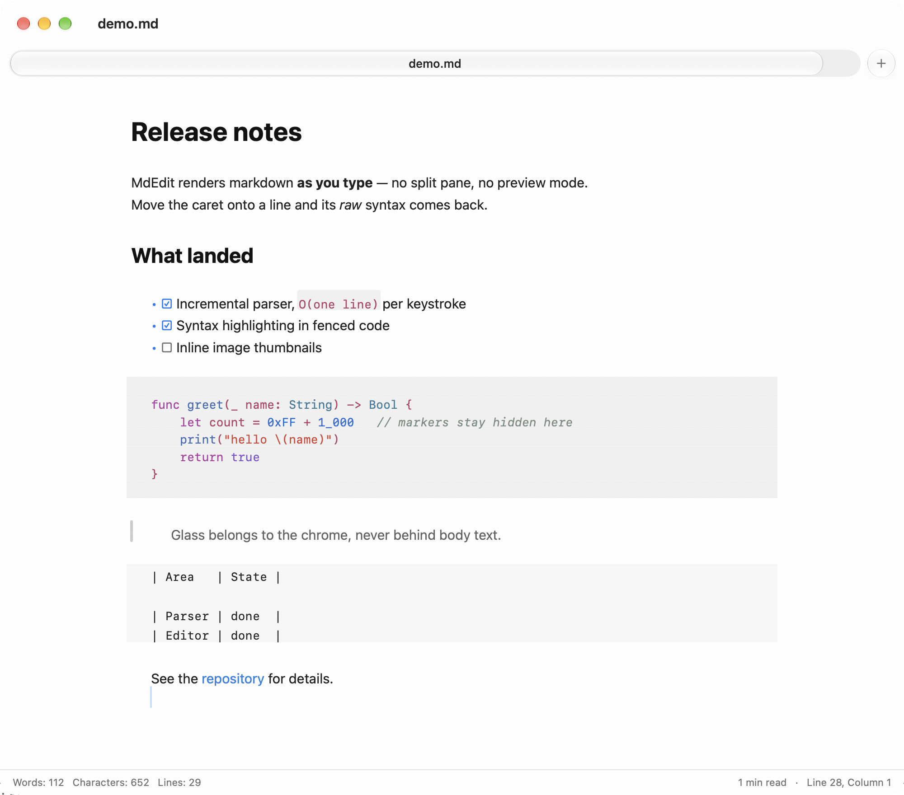

# MdEdit

A native macOS markdown editor with real-time in-place WYSIWYG, in the spirit of
[MarkText](https://github.com/marktext/marktext) — but written in Swift, with no
Electron, no web view, and no third-party dependencies.

Type `# ` and the line *becomes* a heading where you typed it. `**bold**` renders
bold with the asterisks hidden, until you move the caret onto that line and the raw
markdown comes back. There is no split pane and no preview mode to switch to.

<picture>
  <source media="(prefers-color-scheme: dark)" srcset="docs/screenshot-dark.png">
  
</picture>

## Features

- **In-place WYSIWYG.** Headings, bold, italic, strikethrough, inline code, links,
  images, autolinks, escapes, blockquotes, nested lists, task lists, tables and
  thematic breaks all render as you type. Syntax markers are hidden on every line
  but the one you are editing.
- **Syntax highlighting** in fenced code blocks for ~30 languages.
- **Liquid Glass chrome** (macOS 26): a segmented tab track with a sliding glass
  thumb, a unified titlebar, and a full-width status bar.
- **Tabs**, find and replace, word and character counts with reading time,
  typewriter and focus modes, and light/dark themes that follow the system.
- **External change detection** — edit a file in another app and MdEdit offers to
  reload it.
- **Export** to HTML or PDF, or copy the document as HTML. `MdEdit --render file.md`
  prints the HTML without opening a window.
- **No dependencies.** The parser, the highlighter and the renderer are all in this
  repository.

## Requirements

macOS 26 or later (the Liquid Glass APIs), and Xcode 26 or later to build.

## Building

```sh
git clone https://github.com/msk-mdi/MDedit.git
cd MDedit
swift build            # library + executable
swift test             # the test suite
Scripts/make-app.sh    # assembles build/MdEdit.app
open build/MdEdit.app
```

`Scripts/make-app.sh release` builds an optimised bundle. The app is ad-hoc signed,
which is enough to run it locally but not to distribute it.
`Scripts/make-icon.swift` regenerates the app icon.

## Keyboard shortcuts

| Shortcut | Action |
| :--- | :--- |
| `⌘B` / `⌘I` | Bold / italic |
| `⌘K` / `⇧⌘K` | Link / inline code |
| `⇧⌘X` | Strikethrough |
| `⌃⌘1`…`⌃⌘6`, `⌃⌘0` | Heading level, paragraph |
| `⇧⌘8` / `⇧⌘7` / `⇧⌘9` | Bulleted / numbered / task list |
| `⇧⌘'` | Blockquote |
| `⌥⌘C` | Code block |
| `⌘T` / `⌘W` | New tab / close tab |
| `⇧⌘[` / `⇧⌘]` | Previous / next tab |
| `⌘F` / `⌘G` / `⌥⌘F` | Find, find next, find and replace |

Return continues lists and blockquotes (and renumbers ordered items); on an empty
item it ends the list instead. Tab and `⇧Tab` indent and outdent list items. Typing
a delimiter with text selected wraps the selection rather than replacing it.

## Supported languages

bash/sh/zsh, python, c, c++, objective-c, swift, javascript, typescript, java,
kotlin, go, rust, ruby, php, lua, sql, json, yaml, toml, css/scss, html/xml, diff,
make and dockerfile, plus their common aliases (`py`, `js`, `ts`, `rs`, `yml`, …).
An unrecognised language renders as plain code.

## How it works

### The parser is incremental by construction

Markdown blocks are line-oriented, so `BlockParser` is a line state machine. Every
line produces a `LineInfo` plus a `CarryState` — the open fence, blockquote depth,
list stack, whether the line above was a paragraph, and the highlighter's own state.

`BlockStructure.update` reparses from the first changed line and **stops at the
first line past the edit whose carry state matches the previous parse**, because
from there nothing downstream can differ. A keystroke in a paragraph restyles one
line; opening a ``` fence restyles the rest of the document. Both are the same code
path.

`InlineParser` is a recursive-descent scanner producing a tree, where every node
keeps its **marker ranges separate from its content range**. That split is what lets
the editor hide syntax and the renderer emit tags from a single parse.

The test suite checks the property that matters: across thousands of random edit
sequences, the incrementally updated structure must equal a parse from scratch.

### The editor hides syntax at the glyph level

`MarkdownTextStorage` reparses and restyles in `processEditing`. Syntax markers get
an `.mdConcealed` attribute, and `MarkdownLayoutManager` — through
`shouldGenerateGlyphs` — gives those characters **no glyphs at all**. The characters
are still in the text, so the caret, selection, undo and save all see real markdown;
they simply are not drawn. The same hook swaps `-` for `•` and `[x]` for `☑`.

Block decoration — code backgrounds, quote bars, table stripes, rules, inline-code
chips — is painted in `drawBackground(forGlyphRange:at:)`.

This is TextKit 1 on purpose: both of those are direct, supported overrides there.

### Highlighting rides along with parsing

A fence's info string selects a language, and a table-driven tokeniser colours
keywords, types, constants, strings, numbers, comments, calls, shell variables,
markup tags and diff lines. The tokeniser's carry state (open block comment, open
triple-quoted string) lives inside `CarryState`, so highlighting inherits the same
incremental rule: opening `/*` restyles the lines below it and stops where the state
matches again.

Because the tokens come from the parser, HTML export gets the same colours for free —
each token becomes a `<span class="tok-…">`, with light and dark CSS in the exported
stylesheet.

### Liquid Glass is for the chrome, never the canvas

The text canvas is opaque and flat. Body text over a refracting backdrop is
illegible, and that is not what the material is for; glass belongs to the chrome
above it, and the canvas is what that chrome refracts.

The tab strip is shaped like a segmented control: a recessed track spanning the
window, equal-width segments, and **one raised glass thumb that slides** to the
selected tab. That slide is the tab-switch animation — a single piece of glass
moving, not a crossfade. The track itself is a tinted fill rather than glass, so the
thumb is the only glass in the row; stacking glass on glass reads as muddy.

`GlassPanel` wraps `NSGlassEffectView` and falls back to a solid fill under Reduce
Transparency. Reduce Motion is honoured for the thumb and for typewriter scrolling.

## Project layout

```
Sources/MarkdownKit/   Parsing, syntax highlighting, HTML rendering. No AppKit.
Sources/MdEdit/        The app: text storage, layout manager, window, chrome.
Tests/MarkdownKitTests/  Parser, highlighter and renderer tests.
Tests/MdEditTests/       Text storage tests.
Scripts/make-app.sh    Assembles the .app bundle around the SwiftPM binary.
Scripts/make-icon.swift Draws the app icon.
```

`MarkdownKit` has no AppKit import and can be used on its own as a markdown parser
and HTML renderer.

## Tests

```sh
swift test
```

47 tests covering block and inline parsing, incremental-reparse equivalence under
random edits, the highlighter for each language family, HTML rendering, and the text
storage's line-range handling.

## Not implemented

Tables render as aligned monospaced rows with striping rather than an editable grid.
There is no math rendering, no mermaid diagrams, no sidebar file tree, no image
upload services and no source mode. Inline images show as styled link text;
`NSTextAttachment` thumbnails are the natural next step. The app is unsandboxed and
ad-hoc signed.

## License

Licensed under the Apache License, Version 2.0. See [LICENSE](LICENSE).
