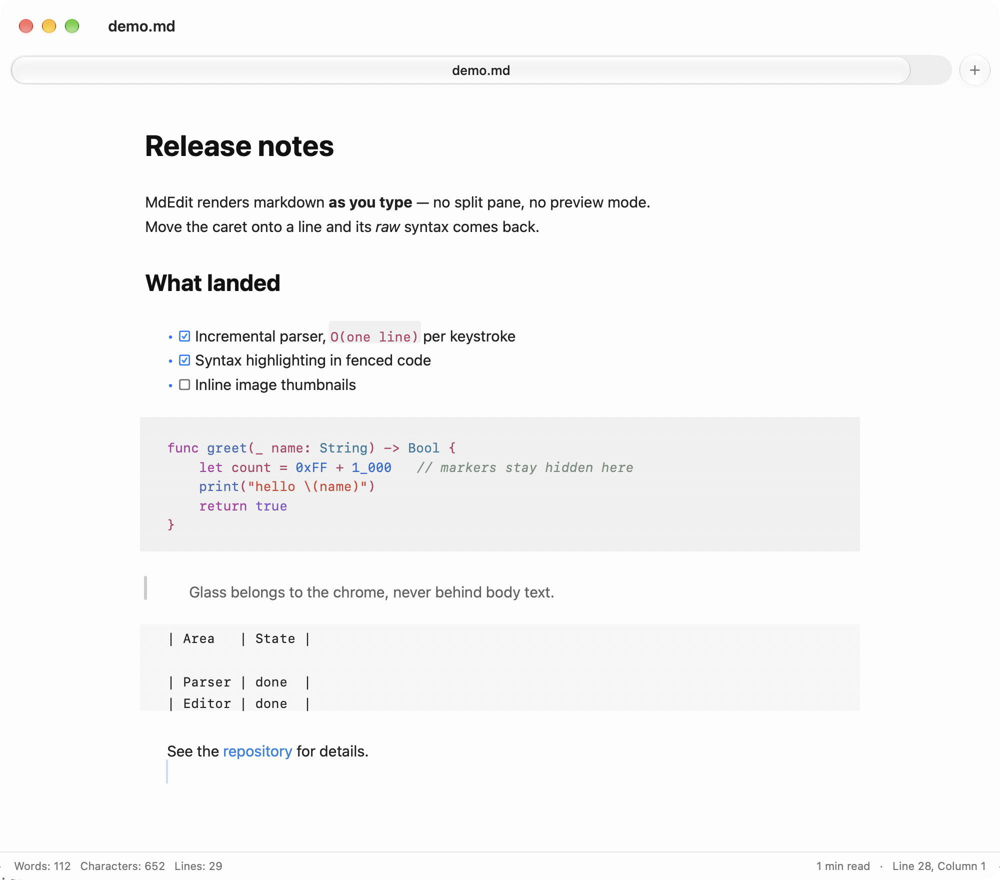

# MdEdit

A native macOS markdown editor with real-time in-place WYSIWYG, in the spirit of
[MarkText](https://github.com/marktext/marktext) — but written in Swift, with no
Electron, no web view for editing, and no third-party Swift dependencies.

Type `# ` and the line *becomes* a heading where you typed it. `**bold**` renders
bold with the asterisks hidden, until you move the caret onto that line and the raw
markdown comes back. There is no split pane and no preview mode to switch to.

<picture>
  <source media="(prefers-color-scheme: dark)" srcset="docs/screenshot-dark.png">
  
</picture>

## Features

- **In-place WYSIWYG.** Headings, bold, italic, strikethrough, inline code, links,
  images, autolinks, escapes, blockquotes, nested lists, task lists, tables and
  thematic breaks all render as you type. Syntax markers are hidden on every line
  but the one you are editing.
- **Extended syntax.** Reference-style links and images, footnotes, YAML front
  matter, raw HTML blocks, `==highlights==`, bare `https://` and `www.` links,
  hard line breaks, `^super^` and `~sub~` scripts, `:emoji:` shortcodes,
  definition lists (`Term` then `: definition`) and `<kbd>` keys — in the editor
  and in export.
- **Math and diagrams.** `$…$` and `$$…$$` TeX is typeset in place by KaTeX, and
  ` ```mermaid ` blocks — flowcharts, sequence, class, state, Gantt, pie and the
  rest — draw as diagrams, in the editor and in export. Put the caret in a block
  to edit its source with a live preview below; a syntax error leaves the source
  showing, with the error as its tooltip.
- **Code blocks.** A language menu and Copy button sit on the block you are in;
  Return closes a fresh fence and keeps indentation inside code.
- **Rich paste.** Formatted text from browsers and documents pastes as markdown.
- **Rich editing.** Click a task box to tick it, ⌘-click a link to follow it
  (web, local files, `#heading` anchors), see images inline with their alt text
  as a caption, paste or drop images (pasted screenshots go to `assets/`), paste a
  URL over text to link it, and switch to plain Source Mode with ⌘/.
- **Tables.** Tab and ⇧Tab move between cells and keep columns aligned, Return
  adds a row (and leaves the table on an empty one), and Format ▸ Table inserts
  tables and adds, removes or aligns rows and columns.
- **Workspaces.** Open a folder (⇧⌘O) for a sidebar with a live file tree, the
  document outline (⇧⌘L) and Find in Folder (⇧⌘F); Quick Open (⌘P) fuzzy-finds
  files. Drag tabs to reorder them, or drop markdown files in to open them.
- **Multiple windows.** ⌘N opens a window with its own tabs and folder; drag a
  tab off the strip (or use Window ▸ Move Tab to New Window) to give it a window
  of its own. Every window, its tabs and its folder come back at the next launch.
- **Your work is safe.** Quitting or closing the window asks about unsaved tabs,
  unsaved text is snapshotted for crash recovery, open tabs come back at launch,
  and files keep their encoding and line endings.
- **Syntax highlighting** in fenced code blocks for ~30 languages.
- **Liquid Glass chrome** (macOS 26): a segmented tab track with a sliding glass
  thumb, a unified titlebar, and a full-width status bar.
- **Writing tools.** Click the word count (or `⇧⌘I`) for statistics — words,
  characters, paragraphs, sentences, reading and speaking time — of the document
  or the selection, and set a word goal the status bar tracks. Fold a heading's
  section away (`⌥⌘←` / `⌥⌘→`, or all of them with `⌃`). Type at several places
  at once: `⌥`-click adds a caret, `⌃⇧↑` / `⌃⇧↓` add one above or below, `⌘D`
  adds the next occurrence of the selection, `⌃⌘G` selects them all, and a
  `⌥`-drag column selection types line by line. Format ▸ Table of Contents
  inserts linked headings. Every open and save keeps a version: File ▸ Revert To
  browses them, alongside any macOS keeps.
- **Tabs**, find and replace, word and character counts with reading time,
  typewriter and focus modes, and light/dark themes that follow the system.
- **Themes and settings.** Built-in Default, Paper, Solarized and Nord themes in
  light and dark, separate code colours (Xcode, GitHub, Solarized, Nord, Monokai),
  and your own `.mdtheme` files — CSS-like blocks of colours, reloaded as you save
  them. Body and code fonts, line height, space after blocks, padding, smart
  quotes, spell checking, list marker style, numbered headings, and each extended
  syntax can be switched off. `⌘+` / `⌘-` / `⌘0` zoom; each tab remembers its
  source, typewriter and focus modes across launches.
- **External change detection** — edit a file in another app and MdEdit offers to
  reload it.
- **Export** to HTML, PDF, Word, RTF or plain text — in any theme, with an optional
  table of contents, embedded images and, for HTML, a stylesheet or none. PDF and
  Print (`⌥⌘P`) lay the document out again at the paper's size, with page breaks
  between lines, the title on each page and page numbers. With
  [Pandoc](https://pandoc.org) installed, export also writes EPUB, ODT, LaTeX,
  Typst and more. Copy as HTML or as rich text for Mail and Pages. A `[TOC]`
  paragraph becomes a table of contents in export.
- **Command line.** `MdEdit --render [file | -] [-o out.html] [--standalone]
  [--theme Nord] [--toc] [--number-headings] [--embed-images]` converts without
  opening a window, reading standard input when no file is given.
- **At home in macOS.** MdEdit is the default editor for markdown files, with
  its own document icon; the space bar previews them in Finder through its Quick
  Look extension. VoiceOver reads the text as it is drawn — no stray `**` or
  `#` — and the tabs as tabs. Help ▸ Markdown Cheat Sheet lists every piece of
  syntax, and Check for Updates… looks for a newer release.
- **No dependencies.** The parser, the highlighter and the renderer are all in this
  repository. Only math and diagrams borrow from the web: KaTeX and Mermaid run in
  one hidden web view, and the editor draws the images it takes.

## Installing

MdEdit needs macOS 26 or later (the Liquid Glass APIs).

**With Homebrew** — it builds MdEdit on your Mac, so it opens without any warning.
It needs Xcode 26 or its Command Line Tools (`xcode-select --install`):

```sh
brew install msk-mdi/tap/mdedit
ln -sf "$(brew --prefix mdedit)/MdEdit.app" /Applications/MdEdit.app
```

`brew upgrade mdedit` updates it, and the link follows. The formula also puts the
`mdedit` command on your path, for `mdedit --render`.

**From a release** — download the DMG from
[Releases](https://github.com/msk-mdi/MDedit/releases) and drag MdEdit to
Applications. MdEdit is free and not notarized by Apple (that takes a paid
developer account), so the first time it opens macOS stops it with "Apple could
not verify…". Click **Done**, open System Settings ▸ Privacy & Security, and
click **Open Anyway** next to MdEdit. Or run this once:

```sh
xattr -dr com.apple.quarantine /Applications/MdEdit.app
```

## Requirements to build

Xcode 26 or later, or its Command Line Tools.

## Building

```sh
git clone https://github.com/msk-mdi/MDedit.git
cd MDedit
swift build            # library + executable
swift test             # the test suite
Scripts/fetch-vendor.sh  # optional: KaTeX and Mermaid, so math and diagrams work offline
Scripts/make-app.sh    # assembles build/MdEdit.app
open build/MdEdit.app
```

`Scripts/make-app.sh release` builds an optimised bundle, with the Quick Look
extension inside. By default it is ad-hoc signed, which is enough to run it
locally but not to distribute it.

### Releasing

1. Set `CFBundleShortVersionString` in `Resources/Info.plist` and add a section to
   `CHANGELOG.md`.
2. Push a `v<version>` tag. GitHub Actions (`.github/workflows/release.yml`)
   tests, builds the app and `Scripts/make-dmg.sh`'s DMG, and publishes a release
   with that CHANGELOG section and install instructions as notes. The DMG holds a
   "First launch.txt" explaining Open Anyway.
3. Update the tap: copy `Packaging/Homebrew/mdedit.rb` to `Formula/mdedit.rb` in
   the `msk-mdi/homebrew-tap` repository, with the new version in `url` and the
   tarball's checksum in `sha256` (the formula's comment has the command).

The same scripts sign and notarize when given an Apple Developer ID, should the
project ever have one: set `MDEDIT_SIGN_IDENTITY` and `MDEDIT_NOTARY_PROFILE`
locally, or the secrets `release.yml` lists. `Scripts/make-app.sh release
--sandbox` signs with the App Sandbox entitlements the Mac App Store requires.

### Other scripts

- `Scripts/lint.sh` — swift-format with `.swift-format`; CI runs it with the tests.
- `Scripts/update-strings.sh` — collects every localizable string into
  `Resources/Localizable.xcstrings`, which `make-app.sh` compiles into the bundle.
  Add a language by translating there (in Xcode, or any `.xcstrings` editor).
- `Scripts/make-icon.swift` — redraws the app and document icons.
- `MDEDIT_BENCHMARKS=1 swift test -c release --filter Performance` — timings for a
  5 MB, 100k-line document.

## Keyboard shortcuts

| Shortcut | Action |
| :--- | :--- |
| `⌘B` / `⌘I` | Bold / italic |
| `⌘K` / `⇧⌘K` | Link / inline code |
| `⇧⌘X` | Strikethrough |
| `⌃⌘1`…`⌃⌘6`, `⌃⌘0` | Heading level, paragraph |
| `⇧⌘8` / `⇧⌘7` / `⇧⌘9` | Bulleted / numbered / task list |
| `⇧⌘'` | Blockquote |
| `⌥⌘C` | Code block |
| `⌘T` / `⌘W` | New tab / close tab |
| `⌘N` | New window |
| `⇧⌘[` / `⇧⌘]` | Previous / next tab |
| `⌘F` / `⌘G` / `⌥⌘F` | Find, find next, find and replace |
| `⌘P` / `⇧⌘O` | Quick Open / open a folder |
| `⇧⌘E` / `⇧⌘L` / `⇧⌘F` | Files / outline / Find in Folder |
| `⌘/` | Source mode |
| `⌘+` / `⌘-` / `⌘0` | Zoom in / out / actual size |
| `⌥⌘←` / `⌥⌘→` | Fold / unfold section (add `⌃` for all) |
| `⌘D` / `⌃⌘G` | Add next occurrence / select all occurrences |
| `⌃⇧↑` / `⌃⇧↓`, `⌥`-click | Add a caret above / below / anywhere |
| `⇧⌘I` | Statistics and word goal |
| `⌥⌘P` | Print |

Return continues lists and blockquotes (and renumbers ordered items); on an empty
item it ends the list instead. Tab and `⇧Tab` indent and outdent list items. Typing
a delimiter with text selected wraps the selection rather than replacing it.

## Supported languages

bash/sh/zsh, python, c, c++, objective-c, swift, javascript, typescript, java,
kotlin, go, rust, ruby, php, lua, sql, json, yaml, toml, css/scss, html/xml, diff,
make and dockerfile, plus their common aliases (`py`, `js`, `ts`, `rs`, `yml`, …).
An unrecognised language renders as plain code.

## How it works

### The parser is incremental by construction

Markdown blocks are line-oriented, so `BlockParser` is a line state machine. Every
line produces a `LineInfo` plus a `CarryState` — the open fence, blockquote depth,
list stack, whether the line above was a paragraph, and the highlighter's own state.

`BlockStructure.update` reparses from the first changed line and **stops at the
first line past the edit whose carry state matches the previous parse**, because
from there nothing downstream can differ. A keystroke in a paragraph restyles one
line; opening a ``` fence restyles the rest of the document. Both are the same code
path.

`InlineParser` is a recursive-descent scanner producing a tree, where every node
keeps its **marker ranges separate from its content range**. That split is what lets
the editor hide syntax and the renderer emit tags from a single parse.

The test suite checks the property that matters: across thousands of random edit
sequences, the incrementally updated structure must equal a parse from scratch.

### The editor hides syntax at the glyph level

`MarkdownTextStorage` reparses and restyles in `processEditing`. Syntax markers get
an `.mdConcealed` attribute, and `MarkdownLayoutManager` — through
`shouldGenerateGlyphs` — gives those characters **no glyphs at all**. The characters
are still in the text, so the caret, selection, undo and save all see real markdown;
they simply are not drawn. The same hook swaps `-` for `•` and `[x]` for `☑`.

Block decoration — code backgrounds, quote bars, table stripes, rules, inline-code
chips — is painted in `drawBackground(forGlyphRange:at:)`.

This is TextKit 1 on purpose: both of those are direct, supported overrides there.

### Export parses the whole document

Line-at-a-time parsing is what keeps typing fast, but some of CommonMark is not
line-local: a list item can hold several paragraphs, a line can lazily continue a
quote, emphasis can span lines. So export uses a second parser, `DocumentParser`,
a port of the spec's container algorithm, and parses inline content only after
every link definition is known. Both share `InlineParser`, which implements the
spec's delimiter-run and bracket algorithm.

`CommonMarkSpecTests` runs all 652 examples of CommonMark 0.31.2: 650 pass. The
two that do not are bare `https://` URLs, which MdEdit links on purpose.

### Highlighting rides along with parsing

A fence's info string selects a language, and a table-driven tokeniser colours
keywords, types, constants, strings, numbers, comments, calls, shell variables,
markup tags and diff lines. The tokeniser's carry state (open block comment, open
triple-quoted string) lives inside `CarryState`, so highlighting inherits the same
incremental rule: opening `/*` restyles the lines below it and stops where the state
matches again.

Because the tokens come from the parser, HTML export gets the same colours for free —
each token becomes a `<span class="tok-…">`, with light and dark CSS in the exported
stylesheet.

### Liquid Glass is for the chrome, never the canvas

The text canvas is opaque and flat. Body text over a refracting backdrop is
illegible, and that is not what the material is for; glass belongs to the chrome
above it, and the canvas is what that chrome refracts.

The tab strip is shaped like a segmented control: a recessed track spanning the
window, equal-width segments, and **one raised glass thumb that slides** to the
selected tab. That slide is the tab-switch animation — a single piece of glass
moving, not a crossfade. The track itself is a tinted fill rather than glass, so the
thumb is the only glass in the row; stacking glass on glass reads as muddy.

`GlassPanel` wraps `NSGlassEffectView` and falls back to a solid fill under Reduce
Transparency. Reduce Motion is honoured for the thumb and for typewriter scrolling.

## Project layout

```
Sources/MarkdownKit/   Parsing, syntax highlighting, HTML rendering. No AppKit.
Sources/MdEdit/        The app: text storage, layout manager, window, chrome.
Sources/MdEditQuickLook/ The Quick Look preview extension.
Tests/MarkdownKitTests/  Parser, highlighter and renderer tests.
Tests/MdEditTests/       Editor, commands, undo, windows, keyboard and performance tests.
Resources/             Info.plist, icons, help pages, string catalog, entitlements.
Scripts/               App, DMG, icon, lint and string-catalog scripts.
```

`MarkdownKit` has no AppKit import and can be used on its own as a markdown parser
and HTML renderer.

## Tests

```sh
swift test
```

Tests covering block and inline parsing, extended syntax, document persistence,
incremental-reparse equivalence under random edits, the highlighter for each
language family, HTML rendering, the CommonMark spec, the text storage, every
Format command and its undo step, window flows (closing and quitting with unsaved
tabs, tab tear-off), typing through real key events, VoiceOver's reading of the
text, and large-file timings.

## Not implemented

Without `Scripts/fetch-vendor.sh` before `make-app.sh`, math and diagrams load
KaTeX and Mermaid from a CDN. Extra carets do not blink. There are no image upload
services. Updates are found, not installed: Check for Updates… opens the release
page. The sandboxed build has not been run in anger: expect pasted images to
need the document's folder open as the workspace (to write `assets/`), and
Pandoc export not to run. No translations ship yet, only the catalog to add them to.

## License

Licensed under the Apache License, Version 2.0. See [LICENSE](LICENSE).
