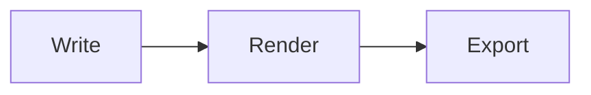

# Markdown Cheat Sheet

Every construct MdEdit understands, as you would type it. Put the caret on a line to see its source; ⌘/ shows the whole page as plain markdown.

## Text

**bold** or __bold__ · *italic* or _italic_ · ***both*** · ~~strikethrough~~ · ==highlight==
`inline code` · H~2~O subscript · E = mc^2^ superscript · :smile: emoji shortcodes
<kbd>⌘</kbd> + <kbd>S</kbd> keys · a backslash \*escapes\* a marker
End a line with two spaces or a backslash for a hard line break.\
Like this.

## Headings

# Heading 1
## Heading 2
### Heading 3

Setext heading
--------------

## Links and images

[A link](https://example.com "with a title") · <https://example.com> · https://example.com
[A reference link][ref] · a footnote[^note]

[ref]: https://example.com
[^note]: Footnotes collect at the end of an export.


## Lists

- Bullets with `-`, `*` or `+`
  - Indent with Tab, outdent with ⇧Tab
1. Numbered
2. Return continues the list
- [x] A finished task
- [ ] An open one: click the box

Term
: A definition list

## Blocks

> A quote
>> nested

```swift
let fenced = "code, highlighted by language"
```

    Four spaces indent a code block too.

---

| Left | Center | Right |
| :--- | :----: | ----: |
| Tab moves | between | cells |

## Math and diagrams

Inline $e^{i\pi} + 1 = 0$, and display:

$$
\int_0^1 x^2\,dx = \frac{1}{3}
$$



## Document extras

A `---` block of YAML at the very top is front matter. A `[TOC]` paragraph becomes a table of contents in export. Raw HTML blocks pass through to export.
